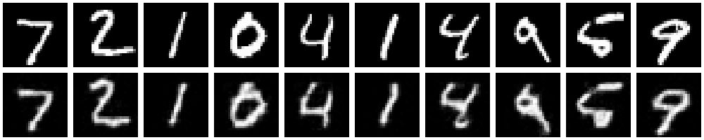

## VAE (Variational Autoencoder)

Simplest VAE implementation, ~100 lines, using MNIST dataset with PyTorch. Run `python vae.py` to train VAE and generate samples in minutes.

## VQVAE (Vector Quantized VAE)

Simplest VQVAE implementation, ~200 lines, using MNIST dataset with PyTorch. Run `python vq_vae.py` to train VQVAE and reconstruct samples in minutes.

### References Implementation
- https://github.com/xiaohu2015/nngen
- https://github.com/AntixK/PyTorch-VAE/blob/master/models/vanilla_vae.py
- https://keras.io/examples/generative/vae/
- https://keras.io/examples/generative/vq_vae/
- https://github.com/deepmind/sonnet/blob/v2/examples/vqvae_example.ipynb