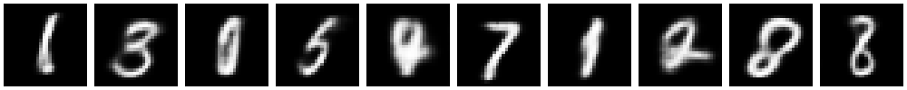

## VAE (Variational Autoencoder)

Simplest VAE implementation, ~100 lines, using MNIST dataset with PyTorch. Run `python vae.py` to train VAE and generate samples in minutes.

## VQVAE (Vector Quantized VAE)

Simplest VQVAE implementation, ~100 lines, using MNIST dataset with PyTorch. Run `python vq_vae.py` to train VQVAE and generate samples in minutes.