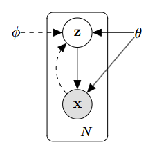

# 从头理解VAE（Variational Autoencoder），ELBO，VLB

## 1. VAE设定
让我们考虑某个数据集 $X = \{x^{(i)}\}_{i=1}^N$由$N$个独立同分布的样本$x$组成。VAE（Variational Autoencoder）假设样本$x$经由隐变量$z$生成，分为两步：1）从先验分布$p_\theta(z)$中采样隐变量$z$；2）从条件分布$p_\theta(x|z)$中采样样本$x$。生成模型的学习目标是使得数据的对数似然最大，即：
$$
\theta^{*} = \arg\max_\theta \sum_{i=1}^n \log p_\theta(x^{(i)})
$$
一个直观的$p_\theta(x)$的展开式为：
$$
p_\theta(x) = \int p_\theta(x, z) dz = \int p_\theta(x|z)p_\theta(z) dz
$$
然而，为了估算积分，我们需要采样大量的$z$，这个式子在实际计算中是不可行的。为了避免这个问题，VAE引入一个近似分布$q_\phi(z|x)$，希望$q_\phi(z|x)$尽可能接近后验分布$p_\theta(z|x)$，这样，从$q_\phi(z|x)$中采样的$z$更容易生成$x$。

如下图所示，$q_\phi(z|x)$即为VAE的编码器，$p_\theta(x|z)$为VAE的解码器。



## 2. ELBO（Evidence Lower Bound）
如前所述，我们希望$q_\phi(z|x)$尽可能接近后验分布$p_\theta(z|x)$，最小化两者的KL散度可以达到这一目的，对其进行展开：

$$
\begin{aligned}
& D_\text{KL}( q_\phi({z}\vert{x}) \| p_\theta({z}\vert{x}) ) & \\
&=\int q_\phi({z} \vert {x}) \log\frac{q_\phi({z} \vert {x})}{p_\theta({z} \vert {x})} d{z} & \\
&=\int q_\phi({z} \vert {x}) \log\frac{q_\phi({z} \vert {x})p_\theta({x})}{p_\theta({z}, {x})} d{z} & \scriptstyle{\text{; Because }p(z \vert x) = p(z, x) / p(x)} \\
&=\int q_\phi({z} \vert {x}) \big( \log p_\theta({x}) + \log\frac{q_\phi({z} \vert {x})}{p_\theta({z}, {x})} \big) d{z} & \\
&=\log p_\theta({x}) + \int q_\phi({z} \vert {x})\log\frac{q_\phi({z} \vert {x})}{p_\theta({z}, {x})} d{z} & \scriptstyle{\text{; Because }\int q(z \vert x) dz = 1}\\
&=\log p_\theta({x}) + \int q_\phi({z} \vert {x})\log\frac{q_\phi({z} \vert {x})}{p_\theta({x}\vert{z})p_\theta({z})} d{z} & \scriptstyle{\text{; Because }p(z, x) = p(x \vert z) p(z)} \\
&=\log p_\theta({x}) + \mathbb{E}_{{z}\sim q_\phi({z} \vert {x})}[\log \frac{q_\phi({z} \vert {x})}{p_\theta({z})} - \log p_\theta({x} \vert {z})] &\\
&=\log p_\theta({x}) + D_\text{KL}(q_\phi({z}\vert{x}) \| p_\theta({z})) - \mathbb{E}_{{z}\sim q_\phi({z}\vert{x})}\log p_\theta({x}\vert{z}) &
\end{aligned}
$$
移项得：
$$
\log p_\theta({x}) - D_\text{KL}( q_\phi({z}\vert{x}) \| p_\theta({z}\vert{x}) ) = \mathbb{E}_{{z}\sim q_\phi({z}\vert{x})}\log p_\theta({x}\vert{z}) - D_\text{KL}(q_\phi({z}\vert{x}) \| p_\theta({z}))
$$
上式的左边即为我们想要最大化的目标：我们想要最大化数据的对数似然$\log p_\theta({x})$，同时最小化隐变量近似后验和实际后验的KL散度$D_\text{KL}( q_\phi({z}\vert{x}) \| p_\theta({z}\vert{x}) )$。由于KL散度是非负的：
$
\log p_\theta({x}) - D_\text{KL}( q_\phi({z}\vert{x}) \| p_\theta({z}\vert{x}) ) \leq \log p_\theta({x})
$， $p_\theta({x})$称为Evidence，所以上式的右端被称为Evidence Lower Bound（ELBO），有时也称为Variational Lower Bound（VLB）。

对ELBO取负，即可得到VAE的损失函数：
$$


L_\text{VAE}(\theta, \phi)  =  - \mathbb{E}_{{z} \sim q_\phi({z}\vert{x})} \log p_\theta({x}\vert{z}) + D_\text{KL}( q_\phi({z}\vert{x}) \| p_\theta({z}) )
$$
## 3. Reparameterization Trick
对于损失函数的第一项，VAE假定$q_\phi(z|x)$是一个高斯分布，$q_\phi({z}\vert{x}) = \mathcal{N}({z}; {\mu}, {\sigma}^{2}{I})$，其协方差矩阵为对角阵，${\mu}, {\sigma}$为encoder网络预测的均值和标准差向量（在代码中实际预测的是无范围限制的$\log{\sigma}^{2}$）。为了使得梯度能够通过随机采样传递，VAE引入Reparameterization Trick，即将式


$$
{z} \sim q_\phi({z}\vert{x}) = \mathcal{N}({z}; {\mu}, {\sigma}^{2}{I}) 
$$
替换为
$$
{z} = {\mu} + {\sigma} \odot {\epsilon} \text{, where } {\epsilon} \sim \mathcal{N}(0, {I}) 
$$
这样梯度就能够通过${\mu}$和${\sigma}$传递至encoder了。在代码实现中，采样一个$z$即可获得不错的效果
## 4. Loss Function
更进一步，对于损失函数的第一项，VAE假定$p_\theta(x|z)$也是一个高斯分布（也可以是其他分布，我们这里只讨论最general的高斯分布）：
$$
\begin{aligned}
\log p_{\theta}({x} | {z}) &=\log \mathcal{N}\left({x} ; \mu_{\text {dec }}, \sigma_{\text {dec }}^{2} {I}\right) \\
&=\log \frac{1}{\sqrt{\left(2 \pi \sigma_{\text {dec }}^{2}\right)^{d}}} \exp \left\{-\frac{\left\|{x}-\mu_{\text {dec }}\right\|^{2}}{2 \sigma_{\text {dec }}^{2}}\right\} \\
&=-\frac{\left\|{x}-\mu_{\text {dec }}\right\|^{2}}{2 \sigma_{\text {dec }}^{2}}-{\log \sqrt{\left(2 \pi \sigma_{\text {dec }}^{2}\right)^{d}}}
\end{aligned}
$$
其中，$d$为数据的维度，$\mu_{\text {dec }} = f_\theta(z)$为decoder预测的均值向量，$\sigma_{\text {dec }}$一般假设为常数。这样上式右边第二项可以忽略，第一项即为MSE loss。

再来看损失函数的第二项，VAE假设$p_\theta(z)$是一个标准高斯分布，两个高斯分布的KL散度有解析解：
$$
D_\text{KL}( q_\phi({z}\vert{x}) \| p_\theta({z}) )
= -\frac{1}{2} \sum_{j=1}^{J} (1 + \log(\sigma_j^2) - \mu_j^2 - \sigma_j^2)
$$
其中，$J$为隐变量的维度，$\mu_j$和$\sigma_j$分别为encoder预测的均值和标准差向量的第$j$个元素。这样，我们就得到VAE的完整损失函数：
$$
L_\text{VAE}(\theta, \phi)  =  c \cdot \left\|{x}-f_\theta(z)\right\|^{2} -\frac{1}{2} \sum_{j=1}^{J} (1 + \log(\sigma_j^2) - \mu_j^2 - \sigma_j^2)
$$

训练完毕后，我们从标准高斯分布$p_\theta(z)$中采样一个$z$，然后送入decoder生成新样本$x$。
## 5. 代码实现
我们以MNIST数据集为例，用一百来行实现一个简单的VAE：https://github.com/schinger/VAEs
encoder采用卷积和全连接层，输入x，输出为z的均值和对数方差。decoder采用全连接和反卷积层，输入z，输出x的均值。代码如下：
```python
class VAE(nn.Module):
    """VAE"""
    def __init__(self, *params):
        super().__init__()
        self.encoder = Encoder(...) # x->mu, log_var of z
        self.decoder = Decoder(...) # z->mu of x
        
    def sample_z(self, mu, log_var):
        """sample z by reparameterization trick"""
        std = torch.exp(0.5 * log_var)
        randn = torch.randn_like(std)
        return mu + randn * std
    
    def forward(self, x):
        mu, log_var = self.encoder(x)
        z = self.sample_z(mu, log_var)
        recon = self.decoder(z)
        return recon, mu, log_var
    
    def compute_loss(self, x, recon, mu, log_var):
        """compute loss of VAE"""
        # KL loss
        kl_loss = -(0.5*(1 + log_var - mu ** 2 - log_var.exp())).sum(1).mean()
        # reconstruction loss
        recon_loss = F.mse_loss(recon, x, reduction="none").sum([1, 2, 3]).mean()
        return kl_loss + recon_loss
```
训练完毕后，我们可以从标准高斯分布中采样隐变量$z$，然后送入decoder生成新样本$x$，效果如下：


VAE的变体有很多，我们在下一篇文章中介绍一个重要变体：Vector Quantized VAE（VQ-VAE）。
