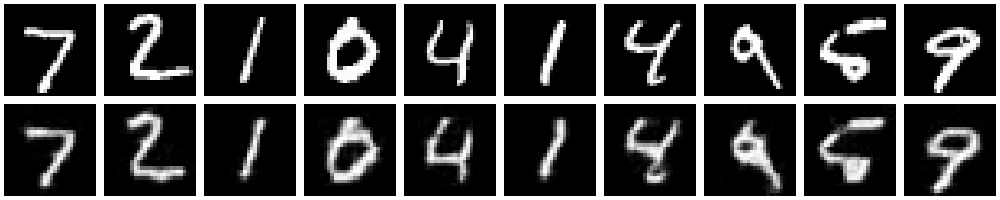

# 从头理解图像分词器，VQ-VAE（Vector Quantized VAE）

## 1. 背景

怎么能把连续的数据（例如图像，视频或者音频）用离散的数据压缩表示呢？这是一个很有趣的问题，VQVAE就是为了解决这个问题而提出。其后，基于VQVAE，很多后续工作也相继出现，例如VQVAE2，VQGAN等等。在多模态大模型时代，这类工作的意义愈发重要，因为将图像token化之后就可以和文本统一处理，自然而然的实现多模态。在这篇文章中，我们将从头理解VQVAE，包括模型建模、损失函数、代码实现等。

## 2. 模型

VQVAE基于VAE，我们先简要回顾下VAE。VAE假设样本$x$经由隐变量$z$生成，分为两步：1）从先验分布$p(z)$中采样隐变量$z$；2）从条件分布$p(x|z)$中采样样本$x$。VAE同时还对隐变量$z$的后验分布$q(z|x)$进行建模，也就是它的encoder。更进一步，VAE假设隐变量$z$是连续型随机变量，$p(z)$，$p(x|z)$，$q(z|x)$都是高斯分布。

不同于VAE，VQVAE假设隐变量$z$是离散型随机变量，$p(z)$是均匀分布，$p(x|z)$可以同VAE一样是高斯分布，$q(z|x)$是one-hot分布，也即给定$x$之后$z$是确定的。接下来，我们详细介绍VQVAE的建模过程。


首先，我们定义一个隐变量的embedding空间$e \in \mathbb{R}^{K \times D}$，其中$K$是embedding的数量，$D$是embedding的维度。VQVAE中，$z$只在这$K$个embedding中取，即$z \in \{0, 1, 2, ..., K-1\}$。具体来讲，模型的encoder以$x$为输入，产出向量$z_e(x)$，然后在embedding table中找到离$z_e(x)$最近的embedding向量$e_k$，得到$z = k$，即，离散化（量子化）的结果。
$$
q(z=k | x)= \begin{cases}1 & \text { for } k=\operatorname{argmin}_{j}\left\|z_{e}(x)-e_{j}\right\|_{2}, \\ 0 & \text { otherwise }\end{cases}
$$
输入给decoder的是距离最近的embedding向量$e_k$，即：

$$
z_{q}(x) = e_k, \quad \text{where} \quad k = \operatorname{argmin}_{j} \|z_e(x) - e_j\|_2
$$

另外，$z$并不是只有一个数。依据数据$x$的类型，$z$有不同的表示方式。一般地，对于语音，图像，视频而言，$z$的表示方式分别是1D，2D，3D的。下图所示为图像的例子，$z$是一个2D的离散feature map（淡蓝色方形），$z_{e}(x), z_{q}(x)$为3D的连续型tensor。


## 3. Straight-Through Estimator
然而，上述模型有个困难之处：argmin操作是不可导的，梯度回传时，无法由$z_q(x)$传递至$z_e(x)$。为了解决这个问题，VQVAE引入了Straight-Through Estimator（STE），如上图的红色箭头所示，直接将$z_q(x)$的梯度copy传递至$z_e(x)$。直观理解，这个近似操作是合理的，因为$z_q(x)$和$z_e(x)$是非常接近的，且正是由$z_e(x)$导致了$z_q(x)$。

代码实现也很简单，对$z_q$做如下一行恒等变换：
```python
    # ... encoder compute z_e through x
    # ... quantize z_e to z_q
    z_q = z_e + (z_q - z_e).detach()
    # ... decoder compute x through z_q
```
这样，$z_q$的梯度就直接传递至$z_e$进而传递至encoder了。

## 4. 损失函数
回顾VAE的损失函数，即负的ELBO：
$$
L=  - \mathbb{E}_{{z} \sim q({z}\vert{x})} \log p({x}\vert{z}) + D_\text{KL}( q({z}\vert{x}) \| p({z}) )
$$
对于VQVAE，我们先看KL散度项。由于假定$p(z)$是均匀分布，$q(z|x)$是one-hot分布，KL散度项为常数：
$$
\begin{align*}
D_\text{KL}(q(z|x)||p(z)) &= \sum_z q(z|x) \log \frac{q(z|x)}{p(z)} \\
&= 1 \cdot \log \frac{1}{1/K} \\
&= \log K
\end{align*}
$$
所以只剩第一项重构误差，我们知道，如果$p(x|z)$是高斯分布，那么重构误差就是MSE loss。对于VQVAE，我们还需要加入embedding table的loss，让$e$接近于其对应的$z_e(x)$：$\|\text{sg}[z_e(x)] - e\|_2^2$，其中，sg表示stop gradient操作。

最后，为了防止训练过程中$z_e(x)$在embedding table中震荡反复，或者无休止的增长，我们还需要加入一个commitment loss，让$z_e(x)$尽可能接近其对应的$z_q(x)=e$，再乘以一个超参数$\beta$：$\beta \|z_e(x) - \text{sg}[e]\|_2^2$。


总结起来，完整的loss为：
$$
L = c \cdot \left\|{x}-f_\text{Dec}(z_q(x))\right\|_2^{2} + \|\text{sg}[z_e(x)] - e\|_2^2 + \beta \|z_e(x) - \text{sg}[e]\|_2^2
$$

另外，如果要生成新样本，在训练时还需要对$p(z)$进行建模训练，对于语音，图像，视频而言，$z$分别是1D，2D，3D token tensor。可以采用PixelCNN，Transformer等自回归模型对离散的$z$进行建模。具体而言，先训练完毕encoder和decoder，然后对所有训练数据$x$，inference得到$z=z_q(x)$，然后对$z$进行自回归训练。
## 5. 另一种理解
我们可以注意到，VQVAE的整个训练和建模过程其实全部都是确定性的，没有随机性。例如，$z_e(x)$和$z_q(x)$的计算是确定性的，Loss是三个MSE之和，也是确定性的。虽然VQVAE可以套进VAE的框架，但是我们也可以将其理解为一个Vector quantized autoencoder，不用涉及任何VAE的知识。
## 6. 代码实现
我们以MNIST数据集为例，用一百来行实现一个简单的VQVAE：https://github.com/schinger/VAEs
 encoder采用卷积层，输入$x$，输出为$z_e(x)$。decoder采用反卷积层，输入$z_q(x)$，输出$x$。向量量化$z_e(x)\rightarrow z_q(x)$及embedding loss，commitment loss由类`VectorQuantizer`实现：
```python
class VectorQuantizer(nn.Module):
    def __init__(self, embedding_dim, num_embeddings, beta):
        super().__init__()
        self.embedding_dim = embedding_dim
        self.num_embeddings = num_embeddings
        self.beta = beta
        self.embeddings = nn.Embedding(self.num_embeddings, self.embedding_dim)
        
    def forward(self, x):
        # [B, C, H, W] -> [B, H, W, C]
        x = x.permute(0, 2, 3, 1).contiguous()
        # [B, H, W, C] -> [BHW, C], C = self.embedding_dim
        flat_x = x.reshape(-1, self.embedding_dim)
        
        encoding_indices = self.get_code_indices(flat_x)
        quantized = self.quantize(encoding_indices)
        quantized = quantized.view_as(x) # [B, H, W, C]
        
        if not self.training:
            quantized = quantized.permute(0, 3, 1, 2).contiguous()
            return quantized
        
        # embedding loss
        q_latent_loss = F.mse_loss(quantized, x.detach())
        # commitment loss
        c_latent_loss = F.mse_loss(x, quantized.detach())
        loss = q_latent_loss + self.beta * c_latent_loss

        # Straight Through Estimator
        quantized = x + (quantized - x).detach()
        
        quantized = quantized.permute(0, 3, 1, 2).contiguous()
        return quantized, loss
    
    def get_code_indices(self, flat_x):
        # compute L2 distance
        distances = (
            torch.sum(flat_x ** 2, dim=1, keepdim=True) +
            torch.sum(self.embeddings.weight ** 2, dim=1) -
            2. * torch.matmul(flat_x, self.embeddings.weight.t())
        ) # [BHW, num_embeddings]
        encoding_indices = torch.argmin(distances, dim=1) # [BHW,]
        return encoding_indices
    
    def quantize(self, encoding_indices):
        """Returns embedding tensor for a batch of indices."""
        return self.embeddings(encoding_indices)     
```
VQVAE的代码实现如下：
```python
class VQVAE(nn.Module):
    
    def __init__(self, in_dim, embedding_dim, num_embeddings, 
                 beta=0.25):
        super().__init__()
        self.in_dim = in_dim
        self.embedding_dim = embedding_dim
        self.num_embeddings = num_embeddings
        
        self.encoder = Encoder(in_dim, embedding_dim)
        self.vq_layer = VectorQuantizer(embedding_dim, num_embeddings, beta)
        self.decoder = Decoder(in_dim, embedding_dim)
        
    def forward(self, x):
        z = self.encoder(x)
        if not self.training:
            e = self.vq_layer(z)
            x_recon = self.decoder(e)
            return e, x_recon
        
        e, q_c_loss = self.vq_layer(z)
        x_recon = self.decoder(e)
        
        recon_loss = F.mse_loss(x_recon, x)
        
        return q_c_loss + recon_loss    
```
原始样本（上）及重构样本（下）效果如下：



## 7. 总结
在多模态大模型时代，VQVAE作为图像分词器的奠基性工作具有重要的实用意义。在这篇文章中，我们从头理解了VQVAE，包括模型建模、损失函数、代码实现等。希望这篇文章能够帮助你更好地理解VQVAE，也欢迎大家在评论区讨论。

